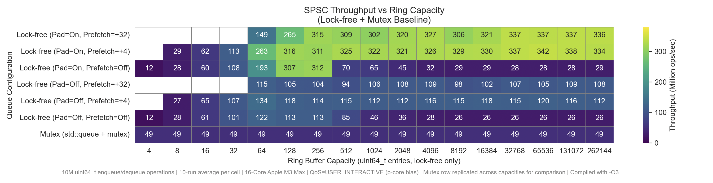
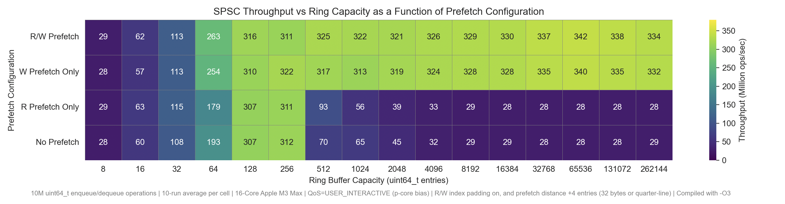

# Foundry Runtime
Foundry Runtime is a collection of runtime tools and performance experiments focused on microarchitectural behavior and thread synchronization across multiple layers of abstraction.  

## Table of Contents
* [SPSC Lock-Free Queue](#spsc-lock-free-queue)
    * [API](#spsc-api)
        * [1. SPSC Template Parameters](#1-spsc-template-parameters)
        * [2. SPSC Functions](#2-spsc-functions)
    * [Performance Experiments](#spsc-queue-performance-experiments)
        * [0. Context](#spsc-experiment-context)
        * [1. Mutex Queue vs Non-Optimized Atomic Implementation](#1-mutex-queue-vs-non-optimized-atomic-implementation)
        * [2. Atomic Index Cacheline Padding + Alignment Optimization](#2-atomic-index-cacheline-padding--alignment-optimization)
        * [3. Software Prefetch](#3-software-prefetch)
* [MPSC Lock-Free Queue](#mpsc-lock-free-queue) - TODO


## SPSC Lock-Free Queue

### SPSC API
This is a single-producer, single-consumer lock-free queue implementation. It is implemented using an array of type `T` as a ring-buffer. It currently only works for trivially copyable types (proof of concept), but I am currently working on making it valid for all types. The API is quite simple and is intended to be used by two separate threads (consumer and producer). Only the producer may call `try_enqueue` and the consumer may call `try_dequeue`. We rely on this to avoid additional constrainsts associated with MPSC and MPMC queues. Violating this results in undefined behavior. Although the queue can be used entirely by a single thread, doing so would be pointless and likely be less peformant than an `std::queue`.   
  
It is defined as follows:  
#### 1. SPSC Template Parameters
```
foundry_runtime::spsc_queue<class T, size_t capacity = 128, bool enable_cacheline_padding = false, size_t prefetch_distance = 0>
```
`T` is the type contained in the queue. Currently it is only valid for trivially copyable types and will generate a compiler error otherwise.  
  
`capacity` is the size of the ring-buffer (just an array of type T) that the queue is implemented as. `capacity` must be a power of 2.  
  
`enable_cacheline_padding` is a performance optimization that stores the atomic read and write (enqueue + dequeue) indices into a struct that is aligned to the size of a cacheline (128 bytes for Apple M-Series computers). This struct is then padded with a char buffer that is never referenced to the length of the cacheline not occupied by the atomic index. As a result, we don't get cache invalidate ping-pong between the two cores running the producer and consumer threads (especially when the read and write indices would share the same cacheline otherwise). 
   
`prefetch_distance` is another performance optimization that uses software read and write prefetch instructions to hint the CPU to pull entries in the ring buffer into the L1 cache of the core running the thread that will soon need them before a read or write occurs. This reduces CPU stalls while the core goes and fetches the line (can be 100s of wasted cycles if not more). The distance ahead in the queue (array) that will be prefetched can be modulated by this template parameter. 0 disables prefetch. Any number beyond this specifies how many entries ahead we prefetch. For example, if we have a uint64_t and specify a `prefetch_distance` of 4, then we will be prefetching 32 bytes ahead (on M3 a quarter-line).  

#### 2. SPSC Functions
`bool try_enqueue(const T& in_data)` is intended to be called from the producer thread and will attempt to enqueue data of type `T` into the queue. It will return `true` if successful and `false` if unsuccessful (ring-buffer is full). The user is responsible for determining whether dropped data is acceptable because if `try_enqueue` returns `false`, `in_data` will not be enqueued.    

`bool try_dequeue(T& out_data)` is intended to be called from the consumer thread and will attempt to dequeue data of type `T` from the queue and store it at the memory location `out_data` points to. It will return `true` if successful and `false` if unsuccessful (ring-buffer empty). The user is responsible for dequeue failure retry logic (thread yielding/sleep/etc).   


### SPSC Queue Performance Experiments
#### SPSC Experiment Context
Although I definitely have some utility for this, I used this as an exercise to explore how these various optimizations vary in performance with various ring buffer capacities. I also compared performance to generic mutex wrapped `std::queue`. I ran 10 million enqueue and dequeue operations 10 times per queue size and optimization permutation and averaged the result into one entry in the plot below. These were all run on my Apple M3 Max with `QoS=USER_INTERACTIVE` to bias towards p-cores, although MacOS provides no user APIs I am aware of that allows me explicitly schedule a thread to be run on a p-core. It is additionally worth noting that I compiled with the -O3 clang compiler flag and that the producer/consumer threads yield on a failure to enqueue or dequeue although experiments with busy waiting did not meaningfully change performance.  
  

The results are quite interesting and illustrate some interesting microarchitectural performance regimes. I will lay out some of my observations and interpretations below. 
#### 1. Mutex Queue vs Non-Optimized Atomic Implementation
a. **Lock-Free Throughput Maxima**   
The lock-free queue of `uint64_t` without prefetch and r/w index padding outperforms a standard mutex queue between ~16-512 entries (128 B to 4 KB). In this range, the entire ring buffer fits easily within each core's 128 KB L1d and is thus not bound by capacity and L2/L3 latency. The mutex implementation uses costly lock/unlock operations, as well as additional branching to serialize execution independent of cacheline contention. The lock-free implementation instead uses atomic r/w index updates. Despite significant traffic between cores, the lock-free queue achieves ~2x throughput in this range (really just ~32-256).  
At small sizes (~4-16 entries), the producer and consumer repeatedly operate on the same cachelines in tight sequence. Each enqueue requires exclusive line ownership with subsequent reads from the consumer. The lines are invalidated and ownership is transferred between cores so frequently that the queue stalls, throttling throughput.  
For larger queue sizes (>~512 entries), although they are all relatively small/fit entirely in the L1d, the reuse distance increases. As a result these lines are less likely to remain hot in the producer's L1d. Without software prefetch, enqueue operations (queue writes) see read for ownership (RFO) latency begin to dominate causing the throughput to collapse as the queue becomes bound by L2/L3 latency (RFOs resolved higher up in the hierarchy). At higher buffer sizes, throughput collapses and ownership latency exceeds mutex latency.  
The lock-free queue transitions from coherence-limited, to RFO latency limited as ring size increases, finding a local maximum between ~16-512 entries, while the mutex based queue is synchronization limited independent of size.   
b. **Worst Case Synchronization Mechanics Between Queue Implementations**      
Beyond the latency considerations of RFO and L1d cache hit frequency, the primary difference between the lock-free queue and mutex implementation is synchronization mechanics. Worst case, the lock-free queue remains entirely in EL0 userspace relying on load acquire and store release memory ordering ops. Alternatively, the mutex implementation may fall back on the kernel when under contention invoking `ulock` wait and wake calls, transitioning to and from EL1 kernelspace.  
To illustrate this, I inspected the ARM assembly generated by each implementation and followed the mutex branches to the stdlib dylibs provided by MacOS Developer Tools (if relevant), that I disassembled. To keep this short(er), I only contrast the enqueue functionality as the dequeue is quite similar and would be redundant.  
`try_enqueue(T&...)` for the lock-free implementation disassembles into the following paths (I follow the branches and focus in on the relevant instructions in the stdlib atomic implementation):  
```
auto current_write_loc = write_next.r_w_index.load(std::memory_order_relaxed); 
// lowers to 
ldr x?, [x?]   

cached_read_loc = read_next.r_w_index.load(std::memory_order_acquire); 
// lowers to
ldapr  x?, [x?]   

write_next.r_w_index.store(next_loc, std::memory_order_release); 
// lowers to
stlr   x?, [x?]    
```
Each strongly ordered atomic load and store to the read and write indices, we set up a very low cost acquire/release instruction pair. Worst case, synchronization is all EL0 with no `dmb` or `dsb` instructions, and no transitions to the kernel (EL1) with some minor branching overhead.  
`try_enqueue(T&...)` for the mutex based worst case has a considerably higher worst case cost. Although uncontended locks tend to stay in user space, under contention the implementation may take a slow path that results in multiple kernel entries.
```
std::unique_lock<std::mutex> lock(mut);
// contentious case translates into a combination of the following calls

__ulock_wait 
// lowers to 
mov    x16, #0x203 ; =515 // syscall 515
svc    #0x80              // EL0 -> EL1 (kernel)

__ulock_wake
mov    x16, #0x204 ; =516 // syscall 516
svc    #0x80              // EL0 -> EL1 (kernel)
```
In the contentious case, the control flow for a single queue write can look like:  
```
Thread A (EL0)
-> try_enqueue(T&...)
-> fails to acquire the mutex
-> __ulock_wait
-> EL0 -> EL1 (Thread A "goes to sleep")

Thread B (EL0)
-> releases the mutex
-> __ulock_wake
-> EL0 -> EL1 ("wakes up" Thread A)

Thread A 
-> resumes execution in EL0
-> writes to the queue
```
A single write to the queue can involve multiple transitions to the kernel, wheras the lock-free implementation always remains entirely in EL0 relying only on acquire/release instructions and cache coherency.  

Kernel transitions can be extremely expensive, but that alone doesn't guarantee better performance. For very small and larger buffer sizes, the unoptimized lock-free implementation performs worse than the mutex-based queue despite avoiding syscalls. This indicates that microarchitecture, not just kernel transitions, drastically affects performance. To address this, I used additional techniques to improve baseline throughput and stabilize across buffer sizes. I outline these below.  
    
#### 2. Atomic Index Cacheline Padding + Alignment Optimization
This is labelled as `Pad=On` on the queue configuration axis. Its purpose is to eliminate false sharing between the ring buffer read and write indices. To achieve this, the atomic read and write inidices are aligned to the size of a cacheline (128 B on M-Series Macs and 64 B on most x86 systems). Each index is padded to completely occupy its own cacheline to prevent unintended interation. 
```
// explicitly set to 128 bytes on my system as this is not included in the MacOS clang installation
static constexpr std::size_t cacheline_size = std::hardware_destructive_interference_size;

// declare the following type that is aligned to the size of a cacheline, and is also exactly the size of a cacheline
struct alignas(cacheline_size) PaddedLine {
    std::atomic<std::size_t> r_w_index{0}; // the actual atomic member we care about
    char pad[cacheline_size - sizeof(std::atomic<std::size_t>)]{}; // empty padding
};

// declare queue read and write indices with the PaddedLine type
PaddedLine write_next{}; 
PaddedLine read_next{}; 
```
Without padding, `write_next` and `read_next` are declared adjacently, so in most cases, share the same cacheline. Although the producer only modifies `write_next` and the consumer only modifies `read_next`, the CPU handles coherence on a cacheline basis. If both indices occupy the same cacheline, we go through a continuous loop of: 
``` 
-> Produce enqueues and writes `write_next`.    
-> Cacheline marked dirty in the producer's core.   
-> The consumers copy of that line gets invalidated even though `read_next` was not modified.      
-> Consumer dequeues and wants to write `read_next`.
-> Consumer core must go out and fetch that line exclusive.
-> Consumer writes `read_next`.       
-> We do this for every enqueue/dequeue pair...   
``` 
Although the variables are independent, the entire cacheline must get moved between cores. This results in a large amount of unintended line ownership transfers. Padding forces `write_next` and `read_next` onto their own cachelines allowing each core to hold exclusive write ownership of that line. The additonal memory footprint is negligible compared to the costly ownership transfer in the alternative.
The effects of this optimization are shown in the plot above. The `Pad=On Prefetch=Off` curve has a similar shape to `Pad=Off Prefetch=Off`, but its local maximum between ~256-512 entries has ~3x higher throughput. At very small buffer sizes, performance is similar to the unoptimized version because the primary performance cost is ownership transfer of actual entries in the ring buffer as opposed to the read/write indices. At larger buffer sizes, reuse distance increases and L2/L3 latency again becomes the limiter. False sharing of the indices does not prevent throughput collapse, and performance converges with the unoptimized version. Cacheline padding alone significantly improves throughput in a very specific window, but it does not address L2/L3 latency associated with larger memory footprint. These experiments were only run with `uint64_t` which is relatively small. I sought a way to stablize across larger memory footprints, both in terms of buffer size and type size.  
#### 3. Software Prefetch
This is labelled as `Prefetch=+N` on the queue configuration axis. It's purpose is to reduce cache miss latency associated with larger memory footprints. To acheive this, I embedded two prefetch calls within `try_enqueue` and `try_dequeue` which prefetch N queue entries ahead. The effective memory distance depends on both `prefetch_distance` and `sizeof(T)`.  
```
// Prefetch index is calculated using prefetch_distance and sizeof(T)
sw_prefetch_write(&queue[prefetch_index]);
// lowers to
prfm   pstl1keep, [x?] // prefetch for store into the L1d and keep

sw_prefetch_read(&queue[prefetch_index]);
// lowers to 
prfm   pldl1keep, [x?] // prefetch for load into the L1d and keep
```
One AArch64, clang lowers to `prfm` hint instructions which are non-binding hints that suggests the processor fetch the line before access. Worst case latency becomes more likely as reuse distance increases and the ring buffer footprint takes up larger amounts of the local cache:  
```
-> The Producer writes queue entry X.  
-> That line is eventually evicted from it's cores specific caches (L1d/L2).  
-> The Consumer later tries to read queue entry X.  
-> If the line is not in any nearby cache, the miss must propogate to further up in the cache hierarchy.  
-> The Consumer reads and processes the entry.  
-> The Producer later attempts to write to the next slot which also may not be in its L1d repeating the above cycle.  
```
As memory footprint increases, these cache miss events increase in frequency, increasing average latency and throttling throughput. Wuthout prefetch, these misses happen the moment data is needed, potentially incurring a cost of 100s of cycles per access depending which layer of the cache hierarchy we miss in.  
To mitigate this, we can use read and write prefetch (although I will show below that write prefetch does the heavy lifting for this type of workload). At small buffer sizes (this is independent of `sizeof(T)`), throughput is still dominated by ownership transfer frequency. Prefetch does not solve this problem. However at larger buffer sizes, prefetch stablizes throughput of the local maximum acheived with `Pad=On Prefetch=Off`, allowing the queue to maintain performance across larger memory footprints. Prefetch distance did not significantly affect throughput for `uint64_t`, although I would expect excessive prefetch distances to not improve performace as significantly as reuse distance increases. I will explore the interaction between `prefetch_distance`, `sizeof(T)`, and `capacity` further below.  
**Note:** it is worth noting that we prefetch on every single queue access, so for smaller `sizeof(T)` this would result in extra `prfm` instructions issued to the CPU, but I did not see any performance differences when modulating this, so I infer that the CPU ignores these extra prefetches, or that they don't incur a penalty as lines will already be in the L1d.   
#### 4. Write vs Read Prefetch
**Analysis IN PROGRESS**   

#### 5. Modulating `sizeof(T)`
**Analysis IN PROGRESS**     
a. Prefetching too far ahead (prefetch operates in an optimal range) => possibly contrast based on data type size.    
b. Contrast data type sizes. How do we do at different sizeof(T).    
#### 6. Combining Prefetch and Padding
**Analysis IN PROGRESS**   
#### 7. Conclusions
**Analysis IN PROGRESS**   
---
[Table of Contents](#table-of-contents)
  
## MPSC Lock-Free Queue
---
[Table of Contents](#table-of-contents)